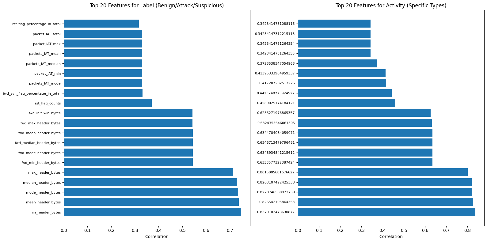
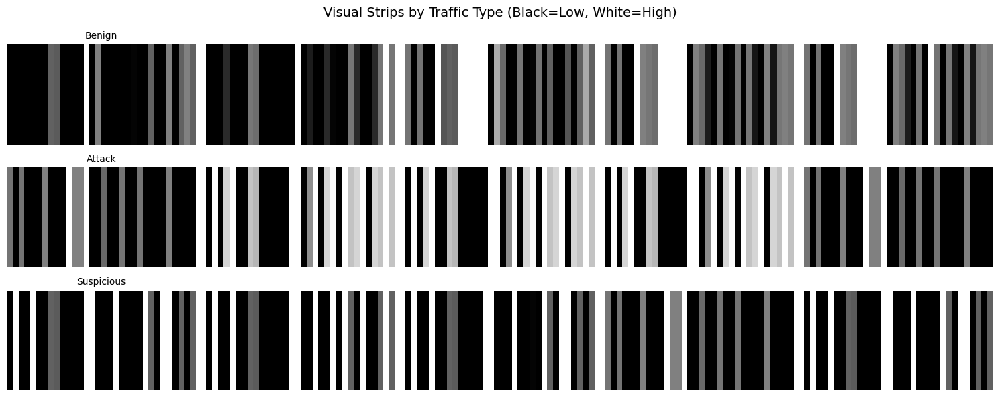
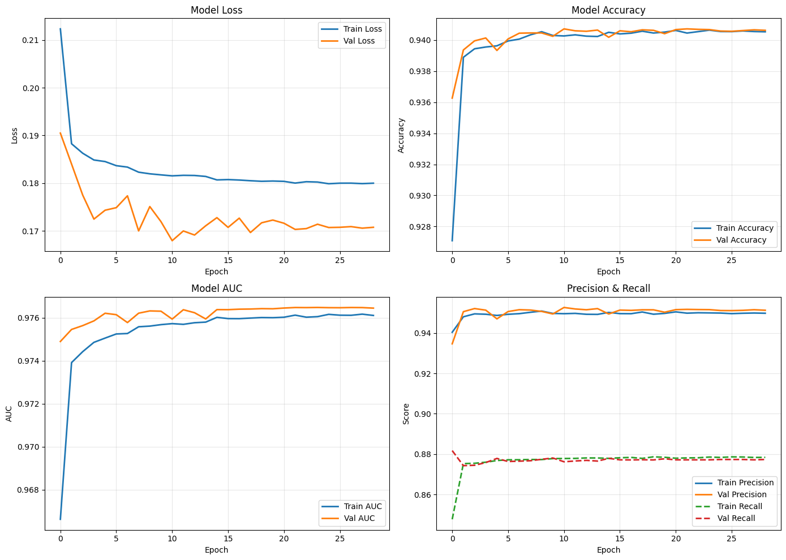
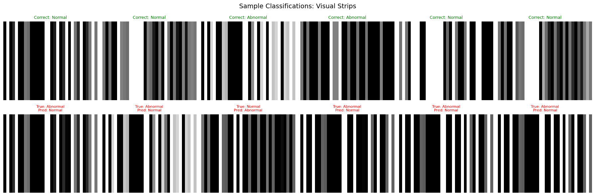
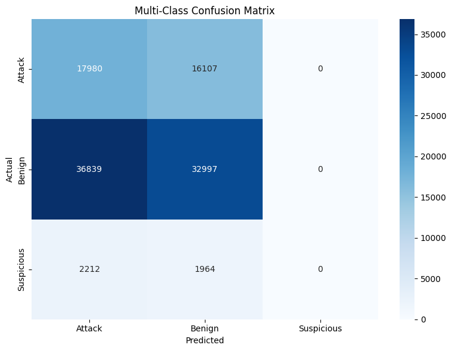
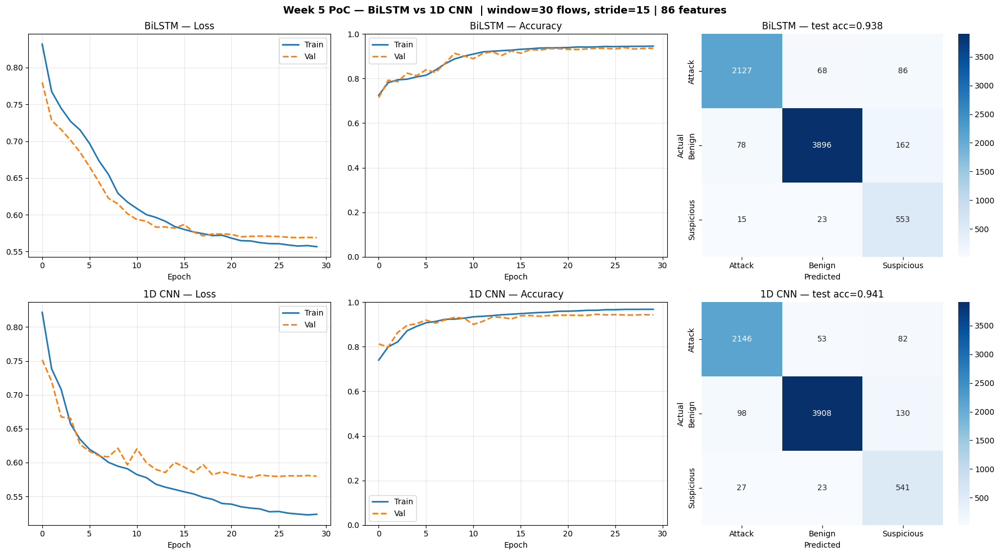
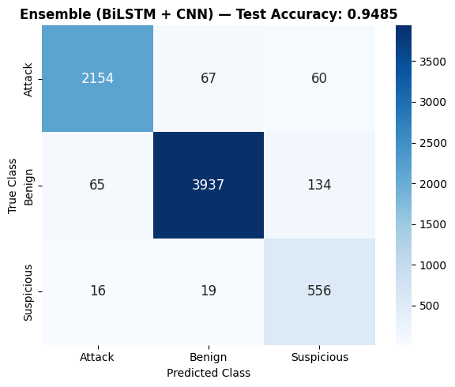
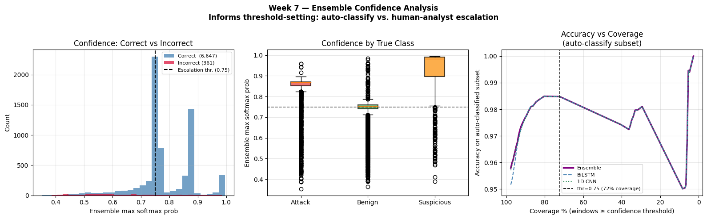

# Intrusion Detection System (IDS) - Capstone Project

A deep learning-based IDS for DDoS detection using temporal sequence modeling (BiLSTM, 1D CNN) and a CNN visual-strip baseline, trained on the **BCCC-Cloud-DDoS-2024** dataset.

## Project Overview

Two complementary approaches:
1. **Baseline (ids_2.ipynb)** — CNN with grayscale visual-strip representation (TensorFlow/Keras)
2. **Temporal PoC (ids.ipynb)** — Temporal models using time-sorted sliding windows of network flows (PyTorch)

## Dataset

- **Source**: `dataset/merged_CSVs.csv` (BCCC-Cloud-DDoS-2024)
- **Total Records**: 700,774 network flows (Dec 14–19, 2023)
- **Raw Features**: 324 columns (timestamp, IPs, protocol, 318 numeric statistics)
- **Features used in models**: ~86 numeric (after cleaning, variance threshold, and correlation pruning)
- **Cleaned cache**: `ddos_clean.parquet` (time-sorted, NaN-free, ready to load)

### Label Distribution

| Label      | Count    | Percentage |
|------------|----------|------------|
| Benign     | 413,199  | 58.9%      |
| Attack     | 228,469  | 32.6%      |
| Suspicious | 59,106   | 8.4%       |

> **Note**: Suspicious traffic is concentrated in the latter days of the capture window (Dec 18–19). This temporal skew is handled by stratified window-level splitting (see below).

### Attack Types (Activity)

The dataset contains 26 specific activity types including:
- Benign traffic (normal browsing, SSH, FTP, email, etc.)
- Various TCP-based attacks (SYN flood, ACK flood, bypass attacks, etc.)
- Suspicious traffic

## Project Structure

```
capstone_ids/
├── dataset/
│   └── merged_CSVs.csv          # Raw source (324 cols, 700k rows)
├── CSVs/CSVs/                   # Per-day raw CSVs (Dec 14-19, 2023)
├── models/
│   ├── bilstm_ids.pt            # BiLSTM + Attention weights (PyTorch)
│   ├── cnn1d_ids.pt             # 1D Residual CNN weights (PyTorch)
│   ├── temporal_scaler.pkl      # MinMaxScaler fit on train-time rows
│   ├── label_encoder.pkl        # LabelEncoder for label col
│   ├── activity_encoder.pkl     # LabelEncoder for activity col
│   ├── variance_selector.pkl    # VarianceThreshold selector
│   ├── corr_keep_idx.npy        # Column indices kept after correlation pruning
│   ├── cnn_binary_ids.keras     # TF/Keras binary CNN (baseline)
│   ├── cnn_multiclass_ids.keras # TF/Keras multi-class CNN (baseline)
│   └── feature_scaler.pkl       # Scaler for baseline model
├── data/
│   └── selected_features.json   # Feature selection results (ids_2)
├── ddos.parquet                 # Processed 32-feature dataset (ids_2)
├── ddos_clean.parquet           # Cleaned, time-sorted dataset (ids)
├── ids.ipynb                    # Main notebook: pipeline + temporal models
├── ids_2.ipynb                  # Baseline notebook: EDA + CNN visual strip
└── README.md
```

---

## Project Progress

### Day 1: Data Loading & Exploration
- Loaded the DDoS parquet dataset
- Explored data structure and distributions
- Identified label columns (`label`, `activity`)
- Analyzed data types (317 features: 261 float32, 25 int8, 20 int32, etc.)

### Day 2: Feature Selection
- Calculated feature importance using correlation analysis
- Selected top 30 features for both Label and Activity classification tasks
- Final feature set: 32 features (union of important features for both tasks)
- **Feature reduction: 89.9%** (317 → 32 features)



#### Top Selected Features
- `packet_IAT_max`, `packets_IAT_mean`, `packet_IAT_total`
- `fwd_max_header_bytes`, `bwd_mean_header_bytes`
- `rst_flag_percentage_in_total`, `syn_flag_percentage_in_total`
- `rst_flag_counts`, `mean_header_bytes`
- And more...

### Day 3: CNN Model Development (ids_2.ipynb)

#### Visual Strip Representation
Each network traffic record is converted into a grayscale visual strip:
- **Strip Dimensions**: 8 x 32 pixels (height x width)
- **Pixel Intensity**: 0 (black) = low values, 255 (white) = high values
- Features are normalized using MinMaxScaler



#### Model Architecture

**Binary Classification CNN** (Normal vs Abnormal):
```
Input (8, 32, 1)
    |
Conv2D(32) -> BatchNorm -> Conv2D(32) -> BatchNorm -> MaxPool -> Dropout(0.25)
    |
Conv2D(64) -> BatchNorm -> Conv2D(64) -> BatchNorm -> MaxPool -> Dropout(0.25)
    |
Conv2D(128) -> BatchNorm -> GlobalAveragePooling
    |
Dense(128) -> BatchNorm -> Dropout(0.5) -> Dense(64) -> Dropout(0.3)
    |
Dense(1, sigmoid) -> Binary Output
```

**Multi-Class CNN** (Benign/Attack/Suspicious):
- Same architecture as binary model
- Output: Dense(3, softmax)

#### Training Configuration
- Optimizer: Adam (lr=0.001)
- Loss: Binary Crossentropy / Sparse Categorical Crossentropy
- Batch Size: 256
- Epochs: 30 (with early stopping)
- Class Weights: Balanced (to handle imbalanced data)
- Callbacks: EarlyStopping, ReduceLROnPlateau



#### Classification Samples


#### Multi-Class Confusion Matrix


### Temporal PoC: ids.ipynb

**Pipeline stages:**

| Stage | Details |
|---|---|
| Load | `merged_CSVs.csv` — 700k rows, 324 columns |
| Clean | Parse timestamp; fix `delta_start` / `handshake_duration` ("not a complete handshake" -> 0); encode `protocol`; fill NaN/Inf with 0; downcast dtypes |
| Sort | Chronological order by `timestamp` — real temporal structure |
| Save | `ddos_clean.parquet` — fast reload for future runs |
| Scale | MinMaxScaler fit on first 70% of rows only (no leakage); transform full dataset |
| Feature selection | VarianceThreshold(0.001) + correlation pruning (r > 0.97) on first 70% rows; apply to all — 318 to ~86 features |
| Window | Build all windows over full time-sorted data (30 flows, stride 15) |
| Split | Stratified 70/15/15 split **at the window level** — all 3 classes in every split |
| Models | BiLSTM + Attention and 1D Residual CNN trained and compared |

**Windowing logic:**
```
Timestamp-sorted flows:
  flow_t-29 -> flow_t-28 -> ... -> flow_t   <- window (30 x ~86 features)
                 stride = 15 (50% overlap)
Label = label of the LAST flow in the window (exact ground truth)

All windows built first, then stratified split ensures
Attack / Benign / Suspicious appear in all splits.
```

**Model A — Bidirectional LSTM + Soft Attention:**
```
Input (B, 30, F)
  -> Linear(F->128) + BatchNorm1d + ReLU + Dropout  input projection
  -> BiLSTM(hidden=128, layers=2)  ->  (B, 30, 256)
  -> Soft attention over 30 timesteps  ->  weighted context (B, 256)
  -> LayerNorm -> Linear(256->64) -> ReLU -> Dropout(0.4)
  -> Linear(64->3)
```

Attention allows the model to focus on the most anomalous flows in the window rather than collapsing the entire sequence to one hidden state.



**Model B — 1D Residual CNN:**
```
Input (B, 30, F)  ->  transpose  ->  (B, F, 30)
  -> Conv1d(F->128, k=1) + BatchNorm + ReLU      input projection
  -> ResBlock(128->128, k=3) + Dropout(0.2) + skip
  -> ResBlock(128->256, k=3) + Dropout(0.2) + proj(128->256)
  -> AdaptiveAvgPool1d(1)  ->  (B, 256)
  -> Linear(256->128->64->3) with Dropout(0.4/0.2)
```

Residual connections prevent gradient vanishing and let each block learn incremental refinements.

## Key Design Decisions

| Decision | Reason |
|---|---|
| Drop `flow_id`, `src_ip`, `dst_ip` | Identifiers — model would memorise addresses, not traffic patterns |
| Sort by `timestamp` before all processing | Preserves real temporal order |
| Scaler fit on first 70% of rows only | Prevents test-set info leaking into normalization |
| Feature selectors fit on first 70% of rows | Avoids test data influencing feature pruning |
| Build windows over full dataset, then stratify | Suspicious flows are clustered at end of timeline; plain temporal split gives 0 Suspicious in training; stratified window split ensures all classes in every split |
| Last-flow window label | Preserves exact ground truth; majority vote silently drops the rare Suspicious class |
| VarianceThreshold + correlation pruning | 318 -> ~86 features; removes near-constant and redundant columns — cleaner gradients, less overfitting |
| Input projection layer (F->128) + BatchNorm | Compresses raw features; BatchNorm stabilises activations across variable-magnitude inputs |
| Soft attention in LSTM | Model learns which flows in the window are most discriminative |
| Residual connections + intra-block Dropout | Prevents gradient vanishing; Dropout in residual blocks adds strong regularisation |
| Label smoothing (0.1) | Prevents overconfident predictions; improves generalisation on rare Suspicious class |
| CosineAnnealingLR | Smooth learning-rate decay across all epochs; avoids sharp LR drops that destabilise training |

## Requirements

```
pandas
numpy
torch
scikit-learn
matplotlib
seaborn
joblib
pyarrow       # for parquet files
tensorflow    # for baseline CNN (ids_2.ipynb only)
```

## Usage

### Run temporal models (ids.ipynb)
Run all cells sequentially. On first run it loads the CSV (~30s). Subsequent runs reload from `ddos_clean.parquet` (fast).

### Inference with saved PyTorch models
```python
import torch, joblib, numpy as np

# Load all pipeline artifacts
scaler    = joblib.load('models/temporal_scaler.pkl')
sel_var   = joblib.load('models/variance_selector.pkl')
corr_keep = np.load('models/corr_keep_idx.npy')
le_label  = joblib.load('models/label_encoder.pkl')

# Re-instantiate model -- input_size must match N_FEATURES after selection
N_FEATURES = len(corr_keep)
model = BiLSTMClassifier(input_size=N_FEATURES, hidden_size=128,
                         num_layers=2, num_classes=3, dropout=0.4)
model.load_state_dict(torch.load('models/bilstm_ids.pt'))
model.eval()

# X_new: (N, 318) raw cleaned feature array
X_scaled = scaler.transform(X_new).astype(np.float32)
X_sel    = sel_var.transform(X_scaled)[:, corr_keep]   # apply same selection

# Build a window (30 consecutive flows)
window = torch.FloatTensor(X_sel[:30]).unsqueeze(0)    # (1, 30, N_FEATURES)
with torch.no_grad():
    pred = model(window).argmax(1).item()
print(le_label.classes_[pred])  # 'Attack', 'Benign', or 'Suspicious'
```

### Run baseline visual-strip CNN (ids_2.ipynb)
```python
import tensorflow as tf, joblib, numpy as np

model  = tf.keras.models.load_model('models/cnn_binary_ids.keras')
scaler = joblib.load('models/feature_scaler.pkl')

def preprocess(features):
    normalized = scaler.transform(features) / 255.0
    strips = np.repeat(normalized[:, np.newaxis, :], 8, axis=1)
    return strips[:, :, :, np.newaxis]   # (N, 8, 32, 1)

predictions = model.predict(preprocess(new_traffic_data))
# 0 = Normal (Benign), 1 = Abnormal (Attack/Suspicious)
```

## Results

| Model | Notebook | Test Accuracy | Notes |
|---|---|---|---|
| CNN Visual Strip (binary) | ids_2.ipynb | **94.05%** | AUC 0.976, Precision 0.95, Recall 0.88 |
| CNN Visual Strip (3-class) | ids_2.ipynb | ~47% | Struggled with Suspicious class imbalance |
| BiLSTM + Attention | ids.ipynb | **93.8%** | See confusion matrix below |
| 1D Residual CNN | ids.ipynb | **94.1%** | See confusion matrix below |
| Ensemble (BiLSTM + CNN) | ids.ipynb | **94.85%** | Soft-vote ensemble |

### Ensemble Confusion Matrix


### Ensemble Confidence Analysis


## Iteration History

### Round 1 — Architecture improvements (targeting >= 80%)

| Change | Before | After | Why it helps |
|---|---|---|---|
| Feature count | 318 raw | ~86 selected | Fewer redundant features -> cleaner gradients |
| Window label | Majority vote | Last-flow label | Majority vote drops Suspicious (8.4%); last-flow preserves all classes |
| Window size | 20 flows | 30 flows | More temporal context per sample |
| LSTM output | Last hidden state | Soft attention over all 30 steps | Model focuses on the most anomalous flows |
| CNN blocks | Plain Conv1d | Residual blocks | Prevents gradient vanishing in deeper network |
| Input projection | Raw F features | Linear(F->128) + BatchNorm first | Stabilises training with high-dimensional input |

### Round 2 — Overfitting fix (stratified split + regularisation)

**Problem identified**: Suspicious flows are temporally clustered at the end of the dataset (Dec 18–19). A plain 70/15/15 temporal split left **0 Suspicious windows in training** (only 2 out of 32,701), while the test set was 38% Suspicious. Models simply never saw the Suspicious class during training.

| Change | Before | After | Why it helps |
|---|---|---|---|
| Split strategy | Temporal 70/15/15 cut on raw flows | Stratified 70/15/15 split on windows | Guarantees Suspicious class in train/val/test |
| Scale + select scope | Applied to 3 separate splits | Fit on first 70% rows, applied to all | No leakage; enables full-dataset windowing |
| Dropout | 0.3 | **0.4** | Stronger regularisation |
| Intra-block dropout (CNN) | None | **Dropout(0.2)** inside residual blocks | Reduces co-adaptation in conv layers |
| BiLSTM head | 256->128->64->3 | **256->64->3** | Simpler head reduces overfitting |
| BiLSTM proj | Linear + ReLU | + **BatchNorm1d** | Normalises activations per time-step |
| Weight decay | 1e-4 | **1e-3** | Stronger L2 regularisation |
| Loss | CrossEntropy | + **label_smoothing=0.1** | Prevents overconfident predictions |
| LR scheduler | ReduceLROnPlateau | **CosineAnnealingLR** | Smooth decay; avoids sharp drops |
| Learning rate | 1e-3 | **3e-4** | More stable training with stronger regularisation |

## Future Work

- [ ] Real-time inference pipeline (streaming window over live traffic)
- [ ] Grad-CAM / SHAP explanations for temporal model decisions
- [ ] Activity-level (26-class) classification
- [ ] Web dashboard for monitoring and alerting

## Author

Capstone IDS Project — BCCC-Cloud-DDoS-2024
